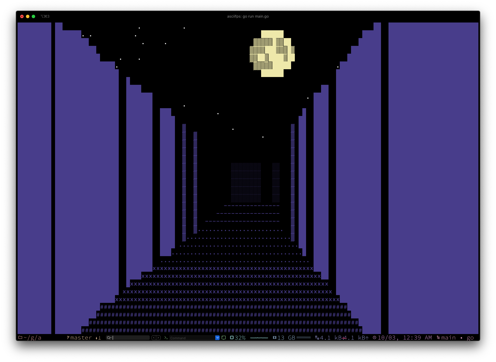

# moonmaze

A naïve and, with one exception, faithful port of JavidX9's CommandLineFPS (https://github.com/OneLoneCoder/CommandLineFPS) from C++ to Go.

Naïve because I made no attempt to rewrite this version as you would a Go program from scratch with behavioral interfaces and whatnot (this is my first real Go program, so I probably couldn't do it justice--but I will try it next!); rather, I wanted to keep the code as 1-1 with JavidX9's version as possible to highlight the purely language-level differences. The only exception is that in a couple of places I've changed a type prefix on a variable name to match the corresponding Go type (e.g., rShade instead of nShade, since Go prefers dealing in unicode runes rather than bytes for characters)
